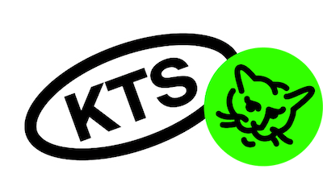

# create-mediaproject-example

Пример CLI для создания приложений по шаблонам.

## Установка

Для использования данного инструмента необходимо:

1. Склонировать репозиторий

```shell
git clone https://github.com/ktsstudio/create-mediaproject-example.git
```

2. Установить зависимости

```shell
cd create-mediaproject-example
yarn install
```

## Использование

1. В командной строке ввести:

```
yarn start
```

2. Выбрать шаблон проекта (доступные шаблоны проектов перечислены ниже):

```
? Select template temp1
```

3. Ввести имя проекта:

```
? Project directory (also name) my-project
```

4. В результате будет создан проект с инициализированным git-репозиторием и установленными зависимостями.

Также доступен интерфейс с флагами:

```
yarn start --template temp1 --dir my-project
```
